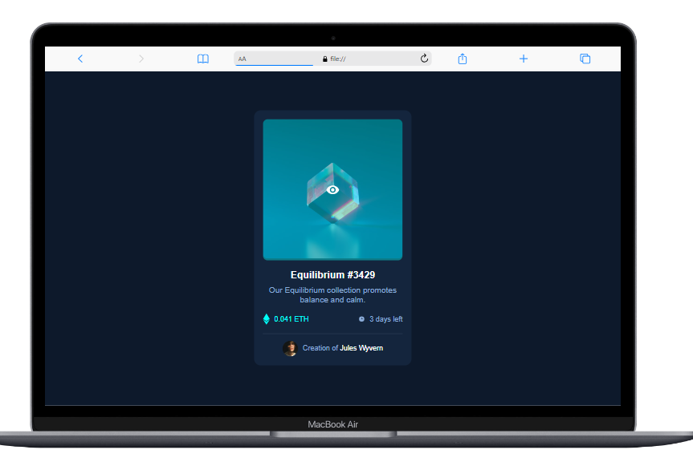

# Make It Real - NFT_PreviewCard

Esta es una solución al proyecto de NFT_PreviewCard del curso Make It Real.

## Tabla de Contenidos

- [Resumen](#resumen)
- [El desafío](#el-desafío)
- [Pantallazo](#pantallazo)
- [Mi proceso](#mi-proceso)
- [Tecnología utilizada](#tecnología-utilizada)
- [Lo que aprendí](#lo-que-aprendí)
- [Desarrollo a futuro](#desarrollo-a-futuro)
- [Recursos útiles](#recursos-útiles)
- [Autor](#autor)
- [Agradecimientos](#agradecimientos)

## Resumen

### El desafío

Los usuarios deben ser capaces de:

Ver una pagina de una card estilizada.
Adaptar la página para que sea responsiva en diferentes tamaños de pantalla, especialmente en dispositivos móviles.

### Pantallazo

Se muestra el pantallazo del modo escritorio y mobile, ee utilizó el archivo CSS con variables de colores :root como base para definir los colores del diseño. Esta metodología permite una fácil gestión y modificación de los colores a lo largo del desarrollo del estilo.

## Mi proceso

### Tecnología utilizada

- Marcado HTML5 semántico
- Propiedades personalizadas de CSS
- Flexbox
- Flujo de trabajo Mobile-first

### Lo que aprendí

Durante el desarrollo de este proyecto, aprendí a implementar una página de error 404 efectiva y estilizada utilizando flexbox para el diseño responsivo y propiedades personalizadas de CSS para la gestión de colores. A continuación, algunos fragmentos de código que destacan:

### Desarrollo a futuro

En futuros proyectos, me enfocaré en mejorar mis habilidades en diseño responsivo y en la optimización de imágenes para asegurar tiempos de carga rápidos. También exploraré más sobre la implementación de animaciones CSS para mejorar la experiencia del usuario.

### Recursos útiles

Guía de Markdown - Me ayudó a aprender a escribir en Markdown y crear documentación clara.
Flexbox Froggy - Un recurso interactivo útil para practicar el diseño con Flexbox.

## Autor

- Github - [@Mikelyto1994](https://github.com/Mikelyto1994)

## Agradecimientos

Agradezco a los instructores del curso Make It Real por proporcionar un marco tan útil para este proyecto. También quiero reconocer a la comunidad de desarrolladores en línea que ofrece valiosos recursos y apoyo.
